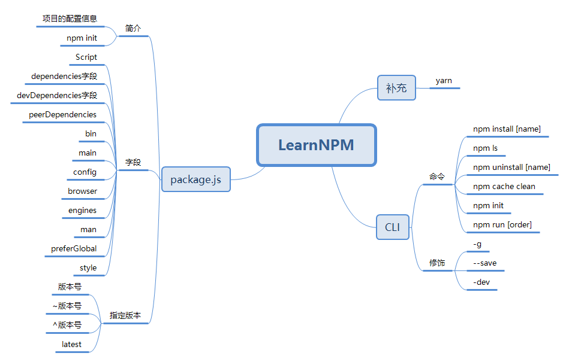
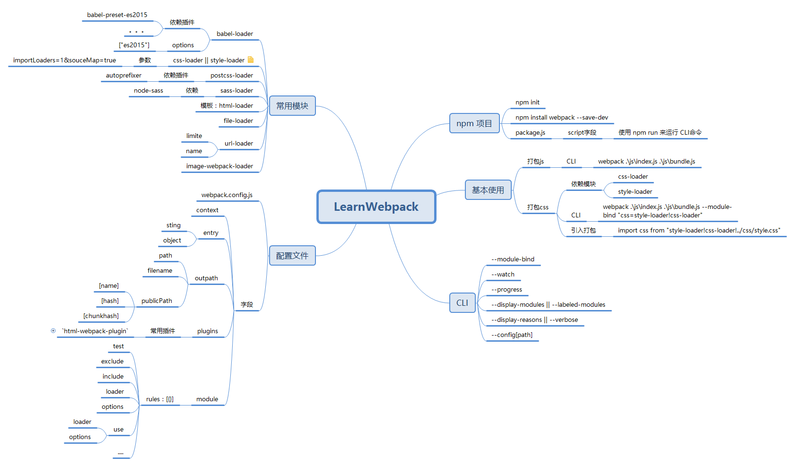

# Related-Tools
记录使用工具中遇到的问题，以及相关解决方法

不求一蹴而就，只求慢慢积累

## Learn NPM

首先 NPM 是一种包管理工具，目前由 Facebook 推出了新的包管理工具 -- yarn（我能怎么样，我也很无奈啊）

## Learn webpack

webpack -- 一种强大的打包工具，但是官方文档极其混乱，一方面希望它早点淘汰，又一方面怕它过早的淘汰。好纠结

