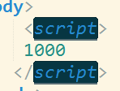

## 快捷键

基本：

1.
选中一组数字然后，通过 `ctrl + s + 向上 || 向下` 可以动态的调节数字

2.
`ctrl + shift + " ` 就可以选中包裹层的标签；

3.
`ctrl + enter` 直接创建并跳到下一行；

4.
`ctrl + shift + enter` 直接创建并跳到上一行；

5.
`ctrl + 左 || 右` 直接到下一个端点；

6.
`shift + ctrl + 左 || 右` 选中直接到下一个端点；

7.
`ctrl + [ || ]` 向左或向右缩进；