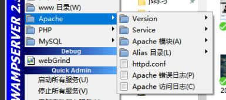
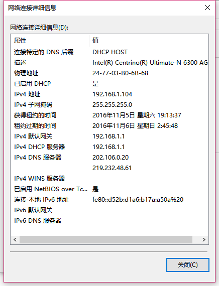

##1. 服务器搭建--PHP环境

###1.1安装
这里使用软件WAMP
百度下载安装，安装目录中不能有中文

注：
问题1：如何使用手机访问?
首先通过 将WAMP切换到在线模式

获取IPv4中的地址，在手机中输入该地址访问；
如果访问失败，查看自己的WAMP中的Apach的版本号，百度：WAMP 局域网访问找寻解决方法

例：2.49下解决方式：
http://jingyan.baidu.com/article/0eb457e53354a803f1a90514.html?st=2&os=0&bd_page_type=1&net_type=1

具体：

找到 httpd.conf
<Directory>
Require local
</Directory>
将
Require local
修改为
Require all granted

问题2：wampserver 主页里点击“Your Projects”下面项目名，地址错误的问题

解决方法：
http://www.bubuko.com/infodetail-1417206.html

这时需要找到www文件夹下的index.php文件，然后修改里面查找$projectContents，或直接查看338行代码，修改‘http://‘为‘http://localhost/‘即可。

##1.2WAMP的简单介绍

根目录下www文件夹为服务器的根目录；
在本机上通过127.0.0.1 或者 localhost 访问;
手机上 通过ip地址访问

不要在开启前使用可能会占用80端口的软件，例如：下载软件和视频播放软件