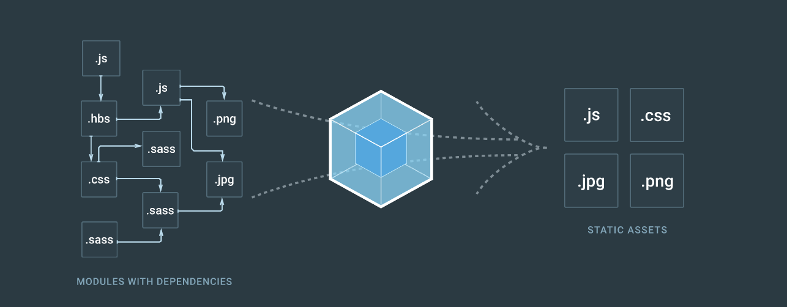
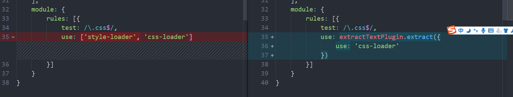

# webpack

    ff 2016-06-11
    目标：了解 webpack 的使用，能够解决实际问题
    参考：

## 简介



webpack 是一个模块管理的工具，主要功能是处理模块之间的相互引用关系，在 webpack 的理念下，一切都是模块；  
从图中可以看出，webpack 是将各种文件视作为模块，模块之间具有各自的引用关系，然后通过 webpack 的处理，将文件合并；

## webpack 常用命令参数

跟在命令后，执行相应操作

- --watch 实时监控，如果对文件进行了修改就重新打包
- --progress 查看打包进程
- --display-modules || --labeled-modules 显示打包的模块
- --display-reasons || --verbose 显示打包的细节
- --config[path] 设定配置文件，默认为根目录下 webpack.config.js 文件

## 实践

以实际的使用方式来学习 webpack

### 实践 -- project

以命令行的方式，使用 webpack 进行 js 文件打包，以及 css 文件打包；

1. 搭建项目目录：

    - project
        - js /  
            - index.js
            - bundle.js
        - css /
            - style.css
        - index.html
    
    style.css -- 样式文件

        ```css
            @charset "utf-8";

            div {
                width: 100px;
                height: 100px;
                box-shadow: 0 0 5px #000;
            }
        ```

    index.js -- 入口文件，一个包含基础 js 的文件，其余的可以通过模块引入便于管理

        ```js
            function say () {
                alert('hi')
            };

            function sayName (){
                alert('my name is ff')
            }
            export default sayName;
        ```
    bundle.js -- 出口文件，htmlWebpackPlugin 会将出口文件引入到 html 中

        ```js
            
        ```
    
    index.html

        ```html
            <!-- 引入打包后的文件 -->
            <!DOCTYPE html>
            <html lang="en">
            <head>
                <meta charset="UTF-8">
                <meta name="viewport" content="width=device-width, initial-scale=1.0">
                <meta http-equiv="X-UA-Compatible" content="ie=edge">
                <link rel="./css/style.css" type="" href="">
                <title>Document</title>
            </head>
            <body>
                <div></div>
                <script src="./js/bundle.js"></script>
            </body>
            </html>
        ```
    
    > 注：如果需要向 github 上提交代码，而跳过模块文件，需要配置 .gitignore 文件，在文件中输入

    ```text
        .DS_Store
        node_modules/
        npm-debug.log
    ```

2. 安装 webpack

    - 搭建项目 `npm init`
    - 安装本地的 webpack `webpack install webpack --save-dev`

3. 打包 js 文件演示

    - 通过 webpack 命令进行打包 `webpack ./js/index.js .js/bundle.js`；  

    命令将 index.js 打包到 bundle.js 中  
    > 注： index.js -- 入口文件 bundle.js 输出文件；

4. 打包 css 文件依赖模块

    webpack 不能直接打包 css 文件，需要模块支持，常用的有：

    - css-loader -- 将 css 文件打包到 js 文件；
    - style-loader -- 将 style 标签插入到 html 中；

    安装：`npm install css-loader style-loader --save-dev`

5. 打包

    - 方法一：
        在入口文件上添加 `import css form '../css/style.css'`
        命令行：`webpack ./js/index.js ./bundle.js --module-bind "css=style-loader!css-loader"`

    - 方法二：
        在入口文件上添加 `import css form 'style-loader!css-lader!../css/style.css'`
        然后运行 `webpack ./js/index.js ./bundle.js'`

    > 注：这里的编译顺序是从右向左的，先要经过 css-loader 再通过 style-loader

### 实践 -- project2

通过配置 webpack.config.js 进行文件打包

1. 搭建文件目录

    - project2
        - dist -- 存放处理后的文件
        - src -- 存放处理前的文件
            - js/
                - index.js
                - sayHi.js
                - sayName.js
            - css/
                - style.css
            - app.js -- 入口文件
        - index.html
        - webpack.config.js
        - package.json

        index.html

            ```html
                <!DOCTYPE html>
                <html lang="en">
                <head>
                    <meta charset="UTF-8">
                    <meta name="viewport" content="width=device-width, initial-scale=1.0">
                    <meta http-equiv="X-UA-Compatible" content="ie=edge">
                    <title>Document</title>
                </head>
                <body>
                </body>
                </html>
            ```

        sayHi

            ```js
                function sayHi (){
                    alert('hi')
                }
            ```
        
        sayName 

            ```js
                function sayName (){
                    alert('ff')
                }
            ```

2. 创建项目 `npm init`

3. 安装依赖

    `npm init`  
    `npm install webpack style-loader css-loader --save-dev`
    
4. 创建 webpack.config.js

    在命令行中使用 `webpack` 命令，可以安装配置文件进行打包，其中默认执行的是 webpack.config.js 文件 如果需要使用其它的配置文件可以通过 `webpack --config [name]` 使用

5. webpack.config.js 基本配置

        ```js
            module.exports = {
                context: '',
                entry: './src/app.js',
                output: {
                    path: './dist/js',
                    filename: 'bundle.js'
                }
            }
        ```
    
    - context -- 文件的上下文环境
    - entry -- 入口文件；入口文件可以使用 3 种类型：
        - string -- 单文件
        - Array -- 多文件
        - 对象 -- {key: value} key 是指这一项的 chunk name；value表示真实的入口文件
    - output 字段 输出文件
        - path -- 输出文件的存放路径
        - filename -- 输出文件的文件名
        - publicPath -- 占位符，当需要上线的时候，这里将引用变成线上地址

        如果输入文件是一个对象并包含多个key，就需要在filename中进行修改，如果只有一个bundle.js 那么后面的会覆盖掉前面的；这时可以通过占位符来进行多个文件的输出：[name],[hash],[chunkhash]

        > 注：hash -- 相当于版本号，chunkhash 只会在文件修改的时候，才会修改的hash，避免了缓存;

    - 示例：
    
           ```js
                // 引入路径模块，便于引入绝对路径；
                var path = require('path');
                
                module.exports = {
                    context: '',
                    entry: {
                        sayHi: './src/js/sayHi.js',
                        sayName: './src/js/sayName.js'
                    },
                    output: {
                        path: './dist/js',
                        filename: '[name]bundle.js',
                        publicPath: 'http://cdn.com'
                    }
                }
            ```
        然后输入 `webpack` 命令进行打包，打包成功后在 dist 中就会出现 `sayHibundle.js` 以及 `sayNamebundle.js`

        publicPath 是为了引入绝对路径，输入的线上地址
    
6. npm 快捷命令

    如果不想每次都要在命令行中运行webpack打包命令，可以通过在npm的配置文件中的Script里，输入运行指令然后直接调用
    
    - 示例：

            ``` json
                "scripts": {
                    "build": "webpack --watch"
                },
            ```

        可以通过`npm run build`执行命令

7. html-webpack-plugin

    HtmlWebpackPlugin 简化了HTML文件的创建，以便为您的webpack包提供服务。 这对于在文件名中包含每次会随着变异会发生变化的哈希的webpack bundle尤其有用。 您可以让插件为您生成一个HTML文件，使用lodash模板提供您自己的模板，或使用您自己的loader。
    [详细文档](https://github.com/jantimon/html-webpack-plugin#configuration)

    - 安装
        `npm install html-webpack-plugin --save-dev`
    - 配置
        在 webpack.config.js 中引入 html-webpack-plugin 文件（这个必须使用 commonjs 语法）
        `var htmlWebpackPlugin = require("html-webpack-plugin")`；
    - 使用
        在 `webpack.config.js` 中加入配置项
        方法一：  
            `plugins: [new htmlWebpackPlugin()]`
            没有输入任何参数，就会在 outpath 路径下新建一个 index.html 文件，并且关联所有的 js （具有 publicPath 前缀）；
        方法二：  
        
            ```js
                plugins: [new htmlWebpackPlugin({
                    filename: path.resolve(__dirname, 'dist/index.html'),
                    template: 'index.html',
                    inject: 'head'
                })]
            ```  
        > 注：
        - new htmlWebpackPlugin() 如果不传入参数就会在 outpath 路径下新建一个 index.html 文件，并且将所有的js 文件关联到这个文件上；
        - template -- 模板文件，以context指示的路径为根路径
        - filename -- 输出的文件名
        - inject -- 将打包的js文件输出到什么位置
    
    - 扩展
        1. 上线压缩 html

                ```js
                    plugins: [new htmlWebpackPlugin({
                        title: 'my project2',
                        filename: path.resolve(__dirname, 'dist/index.html'),
                        template: 'index.html',
                        inject: 'head',
                        minify: {
                            collapseWhitespace: true,
                            collapseBooleanAttributes: true,
                            removeComments: true,
                            removeEmptyAttributes: true,
                            removeScriptTypeAttributes: true,
                            removeStyleLinkTypeAttributes: true,
                            minifyJS: true,
                            minifyCSS: true
                        }
                    })]
                ```
        2. 多个文件的引用  
            如果一个项目中需要同时生成多个文件，可以重复调用 `new htmlWebpackPlugin()`,每一次调用都会生成一次文件,这样就会引入相同的chunk；

            但是如果需要使用各自的chunk，可以在各自的配置项中添加chunks(包含的文件)参数或者excludeChunks(排除的文件)

                ```js
                    plugins: [new htmlWebpackPlugin({
                        title: 'my project2',
                        filename: path.resolve(__dirname, 'dist/index.html'),
                        template: 'index.html',
                        inject: 'head',
                        minify: {
                            collapseWhitespace: true,
                            collapseBooleanAttributes: true,
                            removeComments: true,
                            removeEmptyAttributes: true,
                            removeScriptTypeAttributes: true,
                            removeStyleLinkTypeAttributes: true,
                            minifyJS: true,
                            minifyCSS: true
                        }
                    }),new htmlWebpackPlugin({
                        title: 'my project2',
                        filename: path.resolve(__dirname, 'dist/index2.html'),
                        template: 'index.html',
                        inject: 'body',
                        chunks: ['sayHi']
                    })]
                ```
            这样就会生成两个文件，而在 index2 中只包含 sayHi.js

        3. html模板  
            可以通过plugins的配置，对模板文件进行传参，使用的模板格式：`<% %>`
            我们可以在模板中使用

                ```jsp
                    <% for (var key in htmlWebpackPlugin) { %>
                        <%= key %>
                    <% } %>
                ```
            得到 htmlWebpackPlugin 下的两个属性： `file`(打包文件的相关信息) `option`(传入的自定义属性);  

                ```jsp
                    <% for (var key in htmlWebpackPlugin.files) { %>
                        <% if (key == 'chunks') { %>
                            <% var item = htmlWebpackPlugin.files[key] %>
                            <% for (var chunk in item) { %>
                                <%= chunk%> : <%= item[chunk]%>
                                <br/>
                            <% } %>
                        <% } else {%>
                            <%= key%>: <%= htmlWebpackPlugin.files[key] %>
                        <% } %>
                        <br/>
                    <% } %>
                ```
            得到：

                ```json
                    publicPath: js/
                    sayName : [object Object]
                    sayHi : [object Object]
                    js: js/sayNamebundle.js,js/sayHibundle.js
                    css:
                    manifest:
                ```
            如果继续循环在 chunk 下还具有

                ```json
                    {
                    "size":49,
                    "entry":"/js/sayNamebundle.js",
                    "hash":"29d6d9e58bc3a8780d88",
                    "css":[]
                    },
                ```
            通过这个信息我们就可以随意生成文件的路径
            例如：
                实际使用：手动添加js文件，注：首先要将 htmlWebpackPlugin 配置项中的 inject 值 改成false，阻止默认插入的行为

                ```html
                    <script src="<%= htmlWebpackPlugin.files.chunks.bundle.entry %>"></script>
                ```
        4. htmlWebpackPlugin 内联文件
            如果需要将js文件打包到index.html 文件中可以使用：
            通过模板的方式将文件的内容内联到文件中去；
            使用下面的代码可以提取文件内容

                ```html
                    <script>
                    <%= compilation.assets[htmlWebpackPlugin.files.chunks.bundle.entry.substr(htmlWebpackPlugin.files.publicPath.length)].source() %>
                    </script>
                ```
            注：
            1. 使用 htmlWebpackPlugin.files.chunks.bundle.entry 为添加chunk的入口文件，使用substr是为了截取掉publicPath部分
            2. 这里的chunks是文件引入的chunk，而不是指所有的chunk
            3. compilation.assets -- 将文件接入 通过 source 方法将内容提取出来
            这个时候已经内联的文件，就不需要通过script标签引用了，可以通过通过下面的方法进行筛选
            ```jsp
                    <% for (var item in htmlWebpackPlugin.files.chunks) { %>
                            <% if (item !== 'bundle') { %>
                                <%= item %>
                                    <script src="<%= htmlWebpackPlugin.files.chunks[item].entry %>"></script>
                                    <% } %>
                    <% } %>
            ```

### 实践 -- project3

module 使用 loader

 webpack 中的loader 就相当于预先在文件中定义了一些执行命令，当遇到某些文件的时候，对其进行相应的一个操作  
 使用 project3 来演示

1. 搭建项目目录

    - dist -- 存放编译后的文件
    - src -- 存放编译前的文件
        - components -- 存放项目模块
        - css
        - js
        - app.js -- 入口文件
    - index.html -- 模板文件
    - webpack.config.js -- 配置文件

2. 建立项目 `npm init`

3. 安装常用插件
    `cnpm install --save-dev webpack html-webpack-plugin css-loader style-loader`

4. 配置 webpack.config.js

        ```js
            const { resolve } = require('path');
            const htmlWebpackPlugin = require('html-webpack-plugin');
            const webpack = require('webpack');
            module.exports = {
                context: '',
                entry: './src/app.js',
                output: {
                    path: resolve(__dirname, './dist'),
                    filename: './js/bundle.js'
                },
                plugins: [
                    new htmlWebpackPlugin ({
                        title: 'my project',
                        filename: './dist/index.html',
                        template: 'index.html',
                        minify: {
                            title: 'my project',
                            filename: path.resolve(__dirname, 'dist/index.html'),
                            template: 'index.html',
                            inject: 'body',
                            minify: {
                                collapseWhitespace: true,
                                collapseBooleanAttributes: true,
                                removeComments: true,
                                removeEmptyAttributes: true,
                                removeScriptTypeAttributes: true,
                                removeStyleLinkTypeAttributes: true,
                                minifyJS: true,
                                minifyCSS: true
                            }
                        }
                    })
                ],
            }
        ```

5. babel-loader

    - 安装
        `npm install --save-dev babel-loader babel-core babel-preset-env webpack`
    - 

6. 代码分离 -- css
    为了用 webpack 对 CSS 文件进行打包，你可以像其它模块一样将 CSS 引入到你的 JavaScript 代码中，同时用 css-loader (像 JS 模块一样输出 CSS)，也可以选择使用 ExtractTextWebpackPlugin (将打好包的 CSS 提出出来并输出成 CSS 文件)。

    - 在js文件中引入 css 文件
        `import './style.css`

    - 配置 module 项
    
            ```js
            module.exports = {
                ...
                module: {
                    rules: [{
                        test: /\.css$/,
                        use: ['style-loader', 'css-loader']
                    }]
                }
            }
            ```
    这样，CSS 会跟你的 JavaScript 打包在一起，并且在初始加载后，通过一个 `<style>` 标签注入样式，然后作用于页面。  

    这里有一个缺点就是，你无法使用浏览器的能力，去异步且并行去加载 CSS。取而代之的是，你的页面需要等待整个 JavaScript 文件加载完，才能进行样式渲染。

    webpack 能够用 ExtractTextWebpackPlugin 帮助你将 CSS 单独打包，以解决以上问题。

    - 使用 ExtractTextWebpackPlugin
        1. 在 `webpack.config.js` 中添加 `const extractTextPlugin = require('extract-text-webpack-plugin')`
        2. 修改配置

                ```js
                const { resolve } = require('path');
                const extractTextPlugin = require('extract-text-webpack-plugin');
                const htmlWebpackPlugin = require('html-webpack-plugin');
                const webpack = require('webpack');

                module.exports = {
                    context: '',
                    entry: './src/app.js',
                    output: {
                        path: resolve(__dirname, 'dist'),
                        filename: './js/bundle.js'
                    },
                    plugins: [
                        new htmlWebpackPlugin({
                            title: 'my project',
                            filename: resolve(__dirname, 'dist/index.html'),
                            template: 'index.html',
                            inject: 'body',
                            minify: {
                                collapseWhitespace: true,
                                collapseBooleanAttributes: true,
                                removeComments: true,
                                removeEmptyAttributes: true,
                                removeScriptTypeAttributes: true,
                                removeStyleLinkTypeAttributes: true,
                                minifyJS: true,
                                minifyCSS: true
                            }
                        }),
                        new extractTextPlugin (resolve(__dirname, 'dist/css/style.css'))
                    ],
                    module: {
                        rules: [{
                            test: /\.css$/,
                            use: extractTextPlugin.extract({
                                use: 'css-loader'
                            })
                        }]
                    }
                }
                ```
            

        通过以上两步，你可以将所有的 CSS 模块生成一个新的文件，同时你可以将它作为一个单独标签添加到 index.html中。
    
    - 可以在插入的css文件中通过 @import 引入了别的css文件

7. css - 预处理插件
    这里以 scss 为例
    
    - 安装 `npm install -- save-dev sass-loader node-sass`
    node-sass  是 sass-loader 的 peerDependency，因此能够精确控制它们的版本。

    - 配置 webpack.config.js
    
        ```js
            module: {
                rules: [{
                    test: /\.css$|\.scss$|\.sass$/,
                    use: [{
                        loader: "style-loader" // 将 JS 字符串生成为 style 节点
                    }, {
                        loader: "css-loader" // 将 CSS 转化成 CommonJS 模块
                    }, {
                        loader: "sass-loader" // 将 Sass 编译成 CSS
                    }],
                    exclude: resolve(__dirname, './node_modules'),
                }]
            }
        ```
    我们还可以使用 sass 的相关[配置参数](https://github.com/sass/node-sass)：
    
    - 如果需要将 css 出去出来作为一个单独的文件，还要使用 extract-text-webpack-plugin